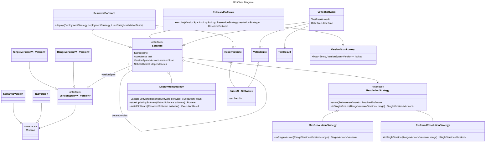

# os-auto-updates

This project contains the API definition of a self-adaptive update system for software packages.
The target machines of this system are woodworking machines for the WOOD 4.0 project.
The concrete implementations are not distributed here because they are part of a closed-source system.

Main contributors:
- Angelo Filaseta (angelo.filaseta@unibo.it)
- Martina Baiardi (m.baiardi@unibo.it)


[](https://codecov.io/github/unibo-wood-4-0/os-auto-updates)

### System Requirements
- Java 11 or higher;

### Kotlin Multiplatform
This project is developed using the [Kotlin Multiplatform](https://kotlinlang.org/docs/multiplatform.html) technology,
which is designed to simplify the development of cross-platform projects.
If you are not familiar with Kotlin Multiplatform, it is recommended to read the official documentation before
contributing to this project.

Since this project is a Kotlin Multiplatform project, it is possible to share some code between the different platforms.
When possible, the code is shared between the JVM and the Native platform, using the `commonMain` sourceSet.
There are some cases in which it is not possible to share the code between the two platforms, for example some classes
that are present in the Java standard library are not present in the Kotlin common library, since they are not
supported by other platforms like Javascript and Native.

As a consequence, some code needs to be written for each platform, using the
[expected/actual](https://kotlinlang.org/docs/multiplatform-expect-actual.html) mechanism.

### Arrow.kt
This project uses lot of APIs from the [Arrow.kt](https://arrow-kt.io/) framework, which provides a lot of utilities
and mechanisms related to Functional Programming.
Mastering the framework can be difficult, but it is recommended to at least understand the basic concepts
before contributing to this project.
In particular, it is encouraged to use [Raise](https://arrow-kt.io/learn/typed-errors/from-either-to-raise/) as
the context of functions where logical failure are expected and can be handled.
Exceptions should [only be used for **exceptional** events](https://arrow-kt.io/learn/typed-errors/working-with-typed-errors/#from-exceptions),
such as I/O or network errors.

## Project structure

This project is structured using different subprojects, each one containing a different part of the project and having
a different purpose.

- **os-auto-updates-api**
  
  
  contains most of the classes and interfaces that are used in the whole 
  project. Such classes are shared among the other subprojects, since they represent the domain of the project.
- **os-auto-updates-resolution**
  Contains classes and interface to define a software with a range of versions and then "resolve"
  (i.e. compute the best one that fits with other dependencies) the version to be installed.

### Quality assurance

#### Static Code Analysis
This project uses [detekt](https://detekt.dev/), [ktlint](https://pinterest.github.io/ktlint/) and
[ktfmt](https://facebook.github.io/ktfmt/) under the hood to ensure code quality and consistency.
It is recommended to install the corresponding plugins in your IDE to avoid problems during the development.

#### Conventional Commits
This project also uses the [Conventional Commits](https://www.conventionalcommits.org/) specification to enforce a
consistent commit message style. If the commit message does not follow the specification, the commit will be rejected
automatically. The scope of the commit is not enforced, but it is recommended to use the short version of the subproject
for which the commit is dedicated, for example `core`, `api` and `rust`. It is possible to omit the scope if the commit
is not related to a specific subproject or if it is related to multiple subprojects at once.

#### Pull Requests
When creating a pull request, also use the Conventional Commits specification for the title of the pull request.
The body of the pull request should contain a brief description of the changes.

## The Gradle build system 
The Build configuration can be found in the `build.gradle.kts` file in the root of the project.
Using the `allprojects` block it is possible to configure all the subprojects at once. The configuration of each
subproject can then be overridden or extended in the `build.gradle.kts` file of the subproject itself.

### Testing
The `check` task will run all the tests, for all the subprojects and target platforms.
```shell
./gradlew check # on Linux, MacOS, or Windows if a bash-compatible shell is available;
gradlew.bat check # on Windows cmd or Powershell;
```

### Running
This repository is meant to expose the API of the self-adapting update system propose,
the implementation is not disclosed since its part of closed-source software.

Therefore, in the current form, it is not possible to `run` the system.

### API structure 



