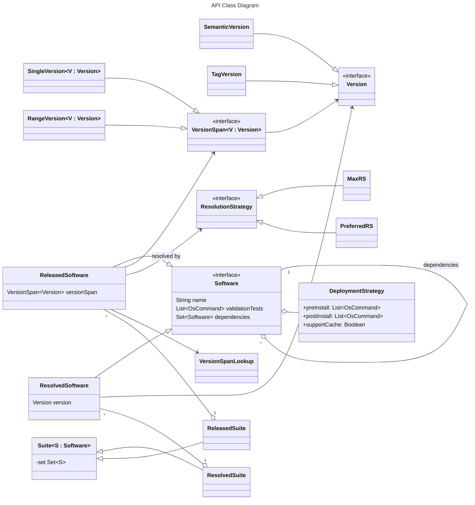

# os-auto-updates

This project contains the API definition of a self-adaptive update system for software packages.
The target machines of this system are woodworking machines for the WOOD 4.0 project.
The concrete implementations are not distributed here because they are part of a closed-source system.

Main contributors:
- Angelo Filaseta (`angelo.filaseta@unibo.it`)
- Martina Baiardi (`m.baiardi@unibo.it`)


[](https://codecov.io/github/unibo-wood-4-0/os-auto-updates)

## System Requirements

- Java 11 or higher

## Kotlin Multiplatform

This project is developed using [Kotlin Multiplatform](https://kotlinlang.org/docs/multiplatform.html),
which is designed to simplify the development of cross-platform projects.
If you are not familiar with Kotlin Multiplatform, it is recommended to read the official documentation
before contributing to this project.

Since this project is a Kotlin Multiplatform project, part of the code can be shared across different platforms.
When possible, the code is shared through the `commonMain` source set.
There are cases in which code cannot be shared completely, for example when platform-specific APIs or libraries
are required and are not available in the Kotlin common standard library.

As a consequence, some code needs to be written for each platform, using the
[expect/actual](https://kotlinlang.org/docs/multiplatform-expect-actual.html) mechanism when appropriate.

At the moment, this repository is configured to build JVM and JavaScript artifacts.

## Arrow.kt

This project uses many APIs from [Arrow](https://arrow-kt.io/), which provides utilities and abstractions related
to functional programming.
Mastering the framework can take time, but contributors are encouraged to understand at least the basic concepts
before working extensively on the codebase.

In particular, it is encouraged to use
[Raise](https://arrow-kt.io/learn/typed-errors/from-either-to-raise/) as the context of functions where logical
failures are expected and can be handled.
Exceptions should [only be used for exceptional events](https://arrow-kt.io/learn/typed-errors/working-with-typed-errors/#from-exceptions),
such as I/O or network errors.

## Project structure

This project is structured using multiple subprojects, each one containing a different part of the system and serving
a specific purpose.

- **os-auto-updates-api**
  
  
  
  contains most of the classes and interfaces used throughout the project.
  These classes are shared among the other subprojects because they represent the core domain model.
- **os-auto-updates-resolution**
  contains classes and interfaces to define software with a range of supported versions and then resolve
  the version to be installed, that is, compute the best concrete version that satisfies dependency constraints.

## Architectural context

This repository models the public API of a larger update architecture described in the accompanying research work.
At a high level, that architecture revolves around four conceptual components:

- a **Software Repository**, which stores deployable artifacts and their metadata
- a **Software Manager**, which synthesizes device-specific update specifications
- a **Suite Installer**, which runs on a target device and applies those specifications
- a **Device**, namely any physical or virtual update target participating in the production environment

Within this architecture, the central concepts represented in this repository are:

- **DSI** (*Device Specification Information*): a machine-readable description of a target device, including identity,
  operating system, installed software, and other context relevant to update decisions
- **Suite Manifest**: a declarative description of the target software configuration for a device, including selected
  components, versions, artifact sources, and dependency relations
- **Suite**: an actionable deployment specification derived from a suite manifest and enriched with installation
  strategies, validation steps, and other deployment-time details

The code in this repository mainly captures the common model for suites, software, deployment strategies,
serialization, and version-resolution logic used by that broader system.

## Example specifications

The repository root contains two sample specifications that reflect the terminology used by the architecture.

### `dsi-sample.json`

This file is an example of a **DSI**.
It is serialized as a CycloneDX-like JSON document and includes:

- device identity metadata
- the operating system installed on the target
- installed applications and versions
- additional properties such as architecture, installation locations, and uninstall commands

This matches the role of the DSI described in the paper: it is the structured device description used by the
software manager to understand the current state of a device before generating an update plan.

### `suite-manifest-sample.json`

This file is an example of a **Suite Manifest**.
It describes a desired software configuration by listing:

- software components and target versions
- package URLs or other distribution references
- component metadata such as publishers, suppliers, and package URLs
- explicit dependency relations between software items

In the architecture described by the paper, a suite manifest is the declarative input used to build a deployable
suite for a specific device.

## Quality assurance

### Static Code Analysis

This project uses [detekt](https://detekt.dev/), [ktlint](https://pinterest.github.io/ktlint/), and
[ktfmt](https://facebook.github.io/ktfmt/) under the hood to ensure code quality and consistency.
It is recommended to install the corresponding plugins in your IDE to avoid problems during development.

### Conventional Commits

This project also uses the [Conventional Commits](https://www.conventionalcommits.org/) specification to enforce
a consistent commit message style.
If the commit message does not follow the specification, the commit will be rejected automatically.

The scope of the commit is not enforced, but it is recommended to use the short name of the subproject for which
the commit is intended, for example `api` and `resolution`.
It is possible to omit the scope if the commit is not related to a specific subproject or if it is related to
multiple subprojects at once.

### Pull Requests

When creating a pull request, also use the Conventional Commits specification for the title of the pull request.
The body of the pull request should contain a brief description of the changes.

## The Gradle build system

The build configuration can be found in the root `build.gradle.kts` file.
Using the `allprojects` block, it is possible to configure all the subprojects at once.
The configuration of each subproject can then be overridden or extended in the corresponding
`build.gradle.kts` file of that subproject.

### Testing

The `check` task runs all the tests for all subprojects and target platforms.

```shell
./gradlew check # on Linux, macOS, or Windows if a bash-compatible shell is available
gradlew.bat check # on Windows cmd or PowerShell
```

### Running

This repository is meant to expose the API of the proposed self-adapting update system.
The concrete implementation is not disclosed because it is part of closed-source software.

Therefore, in its current form, it is not possible to run the full system from this repository alone.

What can be inspected here are:

- the public Kotlin model used to represent devices, software, suites, deployments, and resolution strategies
- the sample JSON specifications in the repository root
- the tests that document expected behavior of the exposed API

## API structure

The following diagram gives a high-level view of the main concepts exposed by the API.
It should be read as a conceptual overview; the source code remains the authoritative reference.


